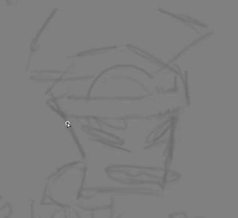

# Introduction to the Canvas
Now that the canvas has been created with your chosen [settings](settings.md), let's learn about the features here that allow us to create art. On the side of the screen is the interface. Which side this interface is on can be changed by going to the Window option at the top of the screen. Different parts of the interface can be moved to different sides. Mine are all kept together on the left. I'll be going over the interface in this order:
 
## 1: Navigation
Here is an overall view of your full canvas. This will locate your display relative to the canvas, and locate the center of your view. Grabbing and dragging the box will allow you to pan your view across the canvas space. Underneath the canvas view are two sliders: Scale and Angle. The scale option controls the zoom. As well as adjusting the slider, the **plus** and **minus** buttons next to the scale option will zoom in and zoom out. The **square** button will reset the view. The scroll wheel also allows you to zoom in and out. The angle slider and buttons allow you to "spin" your camera view. I usually navigate my workspace by zooming out, positioning my cursor where I want to pan to, and then zooming in on that location.
  
More view controls are also available at the top of your canvas; I use these more often. 
   
The dropdown will allow you to pick preset zooms and angles. In addition to this, the button with opposite facing arrows is the **Flip Canvas** button. The stabilizer will slow down your pen strokes for smooth drawing. The slash button will switch to straight line drawing mode.

## 2: The Color Wheel 
Let's talk about how colors work in the digital world. Different colors are created by mixing **red, green, and blue** light at different intensities from ranges between 0 to 255. The color wheel conviniently gives you the ability to change the red, green, and blue content, as well as the saturation and brightness all in one. If this is too much power for you to handle, the buttons located above the color wheel give us more options for mixing colors. This is what the other palette options look like:  
   
And here you can see that 255 range between the RGB colors, as well as hue, saturation, and brightness. Try playing with the sliders and inputting different numbers to see how the color changes. The other buttons will give you tools with which you can create your own gradients (which I use for picking colors to shade with), save your own color palettes (which I use to save palettes for characters I draw often), and another mini canvas to swatch colors on (I'll use this to save colors I'm doing some funky lighting). 

## 3:  Brushes
You can't draw without something to put your colors down with! There are so many different brushes that can all be edited, customized, and you can even create your own brushes. The buttons at the top, once again, give you more options. Binary brushes are for pixel art. Ver.1 are brushes from the original Paint Tool Sai; I love the blur brush from Sai 1 and prefer it to Sai 2's blur brush. Artistic gives us some fancy brushes for painting. Playing with brushes is super fun, and brushes most definitely make a big difference in your art.  

Sai has a few different brush types: Pens, pencils, (paint)brushes, air brushes, markers, and other special brushes like effects brushes. Which ones you use really depend on what are style you're going for. Underneath the brush selection, there's sliders that control even more aspects about how it "draws." The hardness of the brush edge can be soft or harsh. Here you also control the brush size, its minimum size (maybe you want big chunky strokes and don't want your lines to be smaller than a certain width), the density (opacity), as well as minimum density.  

I sketch with a pencil brush on a low density (36%) and small size so that I can build up my sketches. I also shade with a pencil brush, on 100% density and a large brush size. I do lighting with an air brush which allows for soft gradients.

## 4: Layers
Now that we're actually drawing on our canvas, it's time to introduce **layers**. Layers are awesome because they allow for preservation and organization. Layers essentially allow you to stack images on top of each other. You can also change the opacity of the entire layer, or add styles to it, which adds a sort of "effect" to whatever pixels are on that layer. You can even merge layers or transfer an image from one layer to another. Once I've finished a drawing, my layers are usually in this order:
1. (First layer, or bottommost layer) The sketch (this layer is hidden but preserved)
2. Base colors
3. Lineart - I do this on a special kind of layer called a Linework Layer
4. Shadows - Multiply layer style, lowered opacity
5. Lighting - Shine layer style, low opacity
6. Sometimes, I'll add a layer of color over top of everything in the Screen layer style which will add a nice hue to the entire drawing, making it more cohesive.  
  
You can also add folders, or groups, that you can organize layers inside of. If I'm drawing more than one picture on a single canvas, I separate each drawing into its own group. All the buttons for creating, editing, erasing, and deleting layers are found at the top of the layer panel. There's also a checkbox in this area that's labeled **Clipping Group**. Adding a clipping group onto an existing layer is super powerful: this makes it so you can only draw on top of pixels you've already placed down on its parent layer. This may not sound like much, but check out the difference between this image with clipping layers on and off:  
   
The clipping layers have a red bar to the left of them, and they clip onto either a single layer beneath them all, or onto many layers that are within a group. Notice how all the lighting and shading layers have escaped the confines of our character! It would be a lot more tedious and difficult to add details like this if you had to painstakingly stay within the lines. That's the beauty of digital art. We have the technology to do these things faster and easier than on traditional mediums.
  
#### 4.1: The Linework Layer
On the topic of layers, I wanted to dedicate a small section to a feature in Sai that is very dear to my heart, the Linework Layer. But first, we must learn the difference between **raster** and **vector**. 
  
Raster images are made up of **pixels** and are resolution dependent. Because of this, they lose quality when enlarged. When you increase the size of a raster image, new pixels have to be created to fill the space. This can cause it to look blurry. 
  
Vector, on the other hand, are rendered with mathematical formulas. This allows you to scale up vector images and they won't lose quality.  
  
Here is a raster image that I scaled up by 500% compared to a vector image that I scaled up by 500%. Notice how the vector image retains its quality while the raster image gets fuzzy. I created this vector image with a Linework Layer. You can identify the Linework Layer button by the pen on it.    

Adding this layer will give you access to a few new brushes. These brushes are tools for creating vector lines. These lines can be placed, moved, edited, deformed, transformed, copied, rounded, pointed, connected--pretty much anything you would need to do with a line, you can do with these vector lines created with linework layers. Here's a couple of gifs I created. The 1st gif, I am doing lineart with a regular brush. In the 2nd, I am using the Linework Layer's Pen tool.    
    

   As you can see, I feel a lot more free with these moldable vector lines! If I wanted to move or reshape any of these raster lines in the 2nd gif after I had already drawn them, they would suffer from pixelation and a decrease in quality, and wouldn't match the rest of the lines! Vector lines will retain their quality no matter what you do with them (up until you convert them to raster, if you even wish to do this).
  
Now we can take a look at what the process is like and how to export your final image.  
[Home](README.md) | [ About Paint Tool Sai](sai.md) | [Settings for Getting Started With Digital Art](settings.md) | [The Process](process.md)

