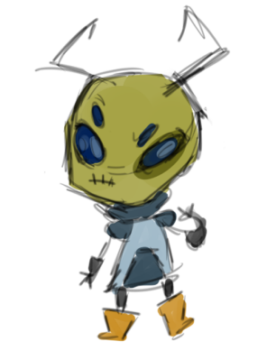
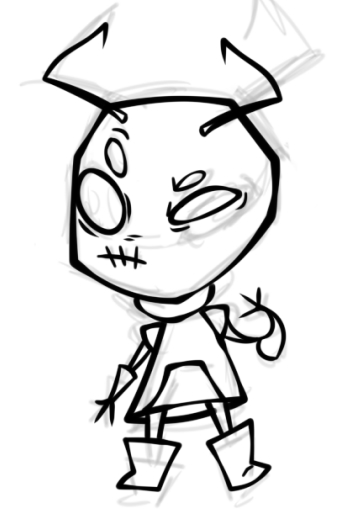
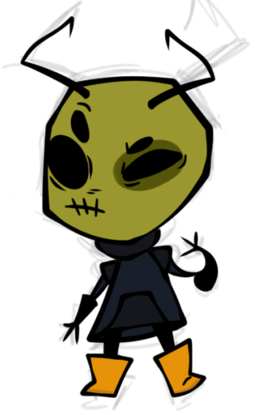
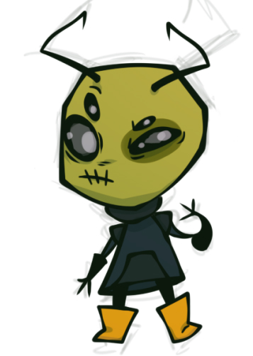
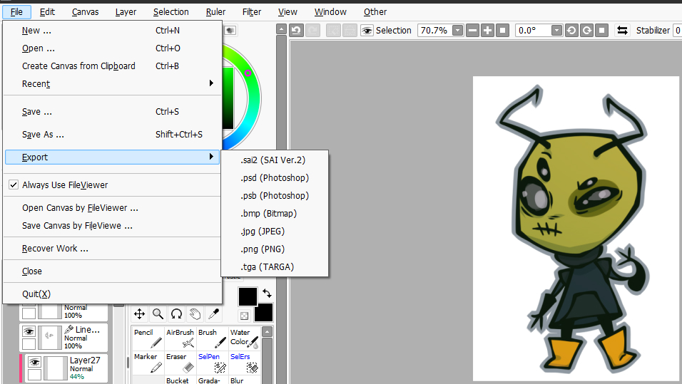

Now, let's go over the process to see how all these elements work together, and see how digital drawings are finished and exported into digital images.  
### The Canvas
First thing I do is go to File/New and create a new canvas that's 3000x3000 pixels and 300 pixels/inch, with a white transparent background.

### The Sketch
I grab a custom brush I've made: a low opacity pen, and start sketching. Sometimes I'll create new layers underneath my sketch layer to play with how I want the colors to look. Make sure it's a decent size and that you're not too zoomed in. You can always shrink the image but making it bigger will be problematic. Here's the sketch for our little alien friend.  
  
### Lineart
Now I create a Linework Layer and get to work on the lineart. I'll usually do the lines for the eyes on a separate layer from the body. In this case I also made his antenna on their own layer as well. Body lines are underneath the eyes lines, and the antenna lines are on on top of the others. I always do these in vector lines because you are free to move and reshape the lines to your heart's content without sacrificing quality. I always draw the head too big and if I wasn't able to just grab those lines and use the transform tool to shape them how I wanted, I would have had to redraw the whole thing.  
  
### Base Colors
To do base colors I use the magic wand tool on the transparent area setting to select the inside of the lines, and the fill bucket tool to place down my colors on a new layer underneath the lines. All the colors for the body are on the same layer, but the color for the eyes are on a layer above those.  
  

### Shading & Lighting
Shading and lighting is the most fun part of the process. To do shadows, I shove all the layers I've created so far into a group/folder. I create a new layer and turn it into a clipping group, clipped to the folder, so the shadows we draw will only appear on what we've drawn already. I take a dark blue color (not black!!!!!!!!) and set it to **multiply**, then turn down the layer opacity. For lighting, I'll create another clipping group on top of these, and choose a color that compliments our palette already. Pink and green go nice togther, so I grab the air brush and lay down some pink over the top half of the image. Set the layer style to either shine or overlay. I also usually add a 2nd multiply layer that has a blue gradient on the bottom portion of the image.  
  
### Finishing & Exporting
Now we add the finishing touches like cropping the canvas to our desired size and any other little things you want to add. Here is where your background settings come into play. There are a couple of things you need to have done to ensure transparecy exists: Chosen a background with transparency, have NOT filled in the background on a layer, and you need to choose the right file format. It's also important to know the difference between different image types.  
  
| Image Type    | Qualities |
| -------- | ------- |
| BMP  | Uncompressed and lossless. Supports transparency *only at a bit depth of 32*. Can cause large file sizes.  |
| JPG | Lossy compression, no transparency support.     |
| PNG    | Lossless compression and transparency support.    |  

I always export as a PNG. To do this, we go to File/Export/PNG (or whatever file type you want). And we are done. Now you should know all the basic information and steps needed to create digital drawings.  
[Home](README.md) | [ About Paint Tool Sai](sai.md) | [Settings for Getting Started With Digital Art](settings.md) | [Introduction to the Canvas](introduction.md) 
