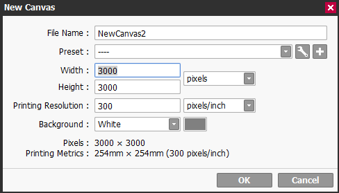
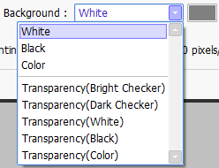
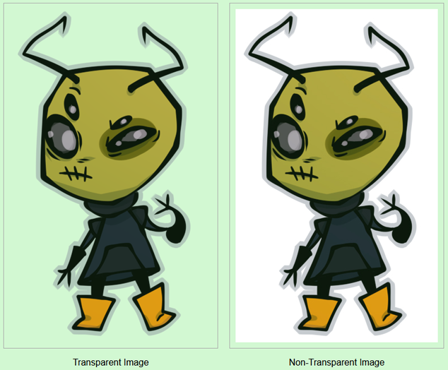

## Settings for Digital Art
Now that we have Paint Tool Sai, let's learn about how to set up a canvas. There are specific settings you want to have in order to create quality art. To start setting up your canvas, hit File/New in the upper left-hand corner, or press **Ctrl+N**. You'll be greeted with a prompt for setting up your new canvas. Let's go over some of these settings:  

| Setting    | Purpose |
| -------- | ------- |
| File Name  | This will be the name of your working canvas and what the file will be saved as|
| Preset | Sai has presets for common resolutions, such as A4 or B5 |
| Width/Height    | The number of pixels long or tall your canvas will be. The unit of measurement can be changed as well     |
| Printing Resolution | 300 is the industry standard that you want to use when creating digital art suitable for print (stickers, bookmarks, etc). Learn more about PPI and DPI [here](https://99designs.com/blog/tips/ppi-vs-dpi-whats-the-difference/).
| Background | Sai 2 allows you to choose what your canvas looks like when it's blank, including *transparent backgrounds* and custom canvas colors. All background options are shown below. |  

  
Transparency is a big thing you want to consider when you're making art. The most common file types that support transparency are **PNG and GIF**. JPEGs do not support transparency. Transparency allows for the removal of color information. When an image with transparency is displayed over a web page, the web page will be visible behind the image where the transparent pixels are present. Image types that do not support transparency will show black or white pixels where the transparent pixels were, depending on how the image was saved. Here is a demonstration of how a PNG with transparency looks versus the same image saved as a JPEG, which does not support the transparent pixels:

### Recommendations
I almost always work on a **3000 x 3000** canvas. You can always crop and shrink an image, but increasing the size is not always as easy. Make sure your image is a sufficient size for what your needs will be. I always use **300 DPI or PPI**. I usually work on a **transparent white background**. These settings can always be changed later, too. Create your canvas and it's time to learn about digital drawing.

[Home](README.md) | [ About Paint Tool Sai](sai.md) | | [Introduction](intro.md) | [Other Tools](tools.md)

